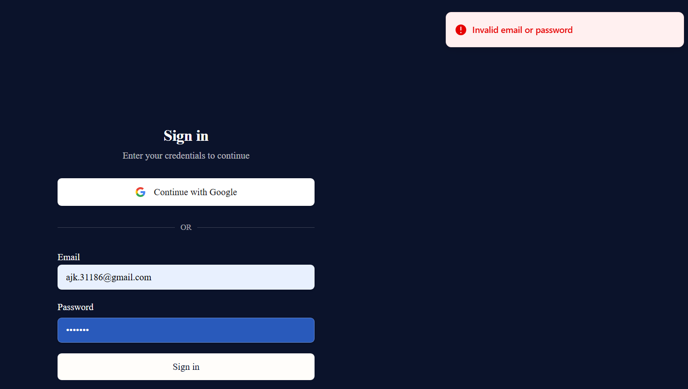
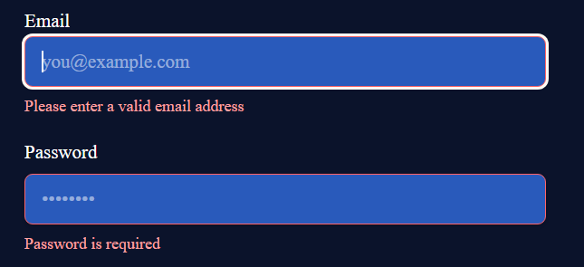
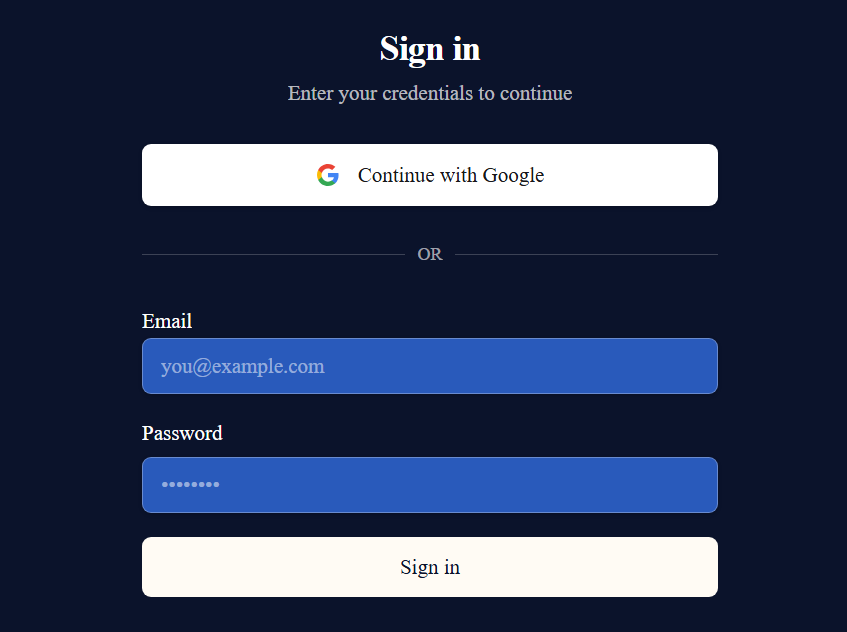
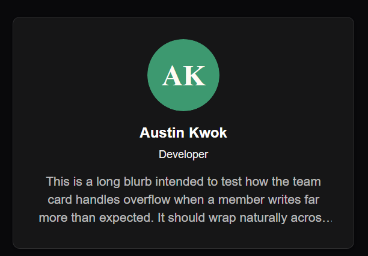
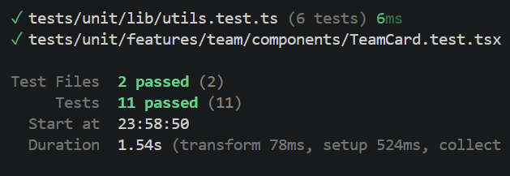
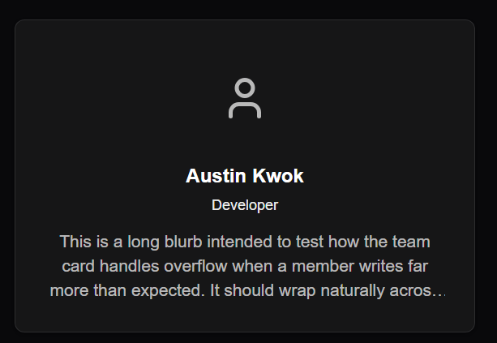

# Test Report - Login → Team Page Flow

**Deployed URL tested:** https://capstone-team-71.vercel.app/
**Automated test:** [`tests/unit/features/team/components/TeamCard.test.tsx`](../tests/unit/features/team/components/TeamCard.test.tsx)
**Date:** 15/8/2026
**Tester:** Austin Kwok

## Findings

### Happy path

| # | Step | Expected Result | Actual Result | Pass/Fail |
|---|------|------------------|----------------|-----------|
| 1 | Go to https://capstone-team-71.vercel.app/ | Home page loads | Home page loads | Pass |
| 2 | Click "Sign in" | Navigates to /auth/signin | Navigates to /auth/signin | Pass |
| 3 | Enter a valid, registered email + password, submit | Login succeeds | Login succeeds | Pass |
| 4 | Observe redirect | Redirects to /team automatically | Redirects to /team automatically | Pass |
| 5 | Check team page | Renders fully - team name, all member cards with photo/name/role/blurb | Renders fully - team name, all member cards with photo/name/role/blurb | Pass |
| 6 | Refresh page while signed in | Stays signed in, page reloads correctly | Stays signed in, page reloads correctly | Pass |
| 7 | Check browser console (F12) | No red errors | No red errors | Pass |

**Happy path: PASS - working as expected.**

### Edge cases

**Invalid login - correct email, wrong password**

| # | Input | Expected Result | Actual Result | Pass/Fail |
|---|-------|------------------|----------------|-----------|
| 1 | Email: `ajk.31186@gmail.com` / Password: `test123` | Show clear error | Show clear error | Pass |

**Invalid login - email not in system**

| # | Input | Expected Result | Actual Result | Pass/Fail |
|---|-------|------------------|----------------|-----------|
| 1 | Email: `test123@gmail.com` / Password: `test123` | Show clear error | Show clear error | Pass |

**Invalid login - blank or malformed input**

| # | Input | Expected Result | Actual Result | Pass/Fail |
|---|-------|------------------|----------------|-----------|
| 1 | Email: "" / Password: "" | "Enter a valid email address/password" | "Enter a valid email address/password" | Pass |

**Invalid login edge cases: PASS - working as expected.**

**Direct `/team` access without logging in**

| # | Step | Expected Result | Actual Result | Pass/Fail |
|---|------|------------------|----------------|-----------|
| 1 | Open an incognito window so there's no existing session | Opens successfully | Opens successfully | Pass |
| 2 | Navigate straight to https://capstone-team-71.vercel.app/team | Navigates to /auth/signin | Navigates to /auth/signin | Pass |

**Direct `/team` access without logging in: PASS - working as expected.**

**Long blurb (visual)**

| # | Input | Expected Result | Actual Result | Pass/Fail |
|---|-------|------------------|----------------|-----------|
| 1 | "This is a long blurb intended to test how the team card handles overflow when a member writes far more than expected. It should wrap naturally across multiple lines and get clipped after the third line without breaking the card's layout or overlapping any of the neighbouring cards in the grid." | Text clips at 3 lines per `line-clamp-3`, with a trailing ellipsis | Text clips at 3 lines per `line-clamp-3`, with a trailing ellipsis | Pass |

**Long blurb (visual): PASS - working as expected.**

**Automated TeamCard tests**

| # | Input | Expected Result | Actual Result | Pass/Fail |
|---|-------|------------------|----------------|-----------|
| 1 | `pnpm run test:component`, run against `tests/unit/features/team/components/TeamCard.test.tsx` | 1000-character blurb does not crash the component, all tests pass | 1000-character blurb does not crash the component, all tests pass | Pass |
| 2 | `pnpm run test:component`, run against `tests/unit/features/team/components/TeamCard.test.tsx` | Fallback icon renders even if `photoUrl` is missing | Fallback icon renders even if `photoUrl` is missing, all tests pass | Pass |

**Automated TeamCard tests: PASS - working as expected.**

## Bugs found

No bugs were found across all visual and automated tests, covering the happy path and edge cases.

## Conclusion

Everything done - no bugs found. Feature is ready to move to Done.
